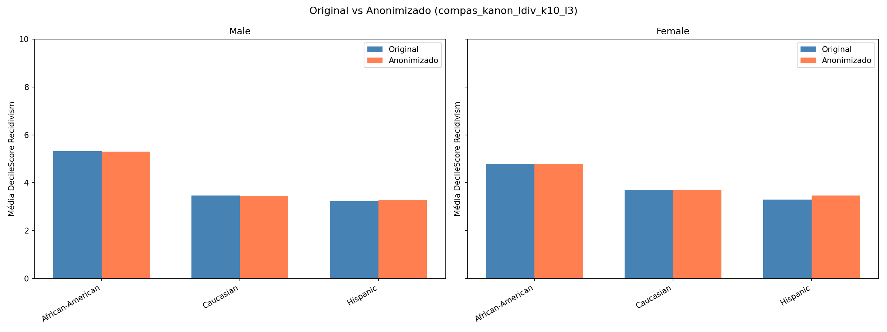

# Anonymizing the COMPAS Dataset: Privacy, Utility and Risk Analysis

Applying k-Anonymity, l-Diversity and t-Closeness to the COMPAS recidivism dataset with
[ARX](https://arx.deidentifier.org/), and measuring what each privacy model costs in terms of
data utility.

Coursework for *Tecnologias de Reforço da Privacidade*, MSc in Information Security, Faculdade de
Ciências da Universidade do Porto. By Artur Correia and Tiago Pinheiro. The full report is in
Portuguese: [`report/main.pdf`](report/main.pdf).

## The problem

In 2016 ProPublica showed that COMPAS, a risk-assessment algorithm used by US courts, assigned
systematically higher recidivism scores to African-American defendants than to Caucasian
defendants with comparable profiles. The dataset behind that investigation contains names, dates
of birth and case IDs of ~18.6K real people.

This project asks a concrete question: **can the dataset be released with formal privacy
guarantees while still supporting the bias analysis it is famous for?**

That framing drives every decision here. The disclosure goal is to let a researcher reproduce the
racial-disparity analysis, so the chosen utility metric is not a generic information-loss score
but the **mean absolute error of the target statistic**: average `DecileScore_Recidivism` broken
down by ethnicity and gender, original versus anonymized.

## Results

Baseline risk on the sanitized (not yet anonymized) dataset: **37.2% of records at risk**, highest
individual re-identification risk **100%**, prosecutor success rate **28.6%**.

| Configuration | Suppressed | Granularity loss | Highest risk | MAE of target statistic |
|---|---|---|---|---|
| k=2, l=2 | 4.21% | 77.36% | 50.0% | 0.380 |
| k=5, l=2 | 4.48% | 78.63% | 20.0% | 0.395 |
| k=5, l=3 | 4.85% | 69.99% | 20.0% | 0.108 |
| **k=10, l=3** | **2.44%** | **66.49%** | **10.0%** | **0.038** |
| k=5, t=0.20 | 4.93% | 52.45% | 1.89% | not comparable |
| k=5, t=0.30 | 4.17% | 65.37% | 12.5% | 0.043 |

**Recommended release: k=10, l=3.** Re-identification risk drops from 100% to 10% while the
racial disparity survives almost intact (MAE 0.038 on a 1-10 scale).



Three findings worth highlighting:

- **Raising k beat raising l.** k=10 with l=3 dominated k=5 with l=3 on every dimension, including
  suppression: larger equivalence classes satisfy the diversity constraint naturally, so the
  solver spends less budget on suppression.
- **t-Closeness is structurally hostile to this disclosure goal.** Requiring each equivalence
  class to mirror the global distribution of the sensitive attribute is precisely a requirement
  that classes must *not* reflect differences between ethnic groups. At t=0.20 the dataset
  collapsed to 4 equivalence classes and the target statistic became meaningless. It only became
  usable at t=0.30 and after restricting the constraint to a single sensitive attribute.
- **Small groups pay the price.** Asian, Native American and Arabic records (<1% each) are merged
  into "Other Minority" under every viable configuration, so per-group conclusions are only
  possible for the three majority groups.

## Method

1. **Preparation** (Python). The raw dataset has 3 rows per person, one per risk type. Invalid
   assessments dropped, only the latest assessment kept, then pivoted to one row per individual:
   60,843 rows / 28 columns → 18,574 rows, 16 analytical columns. `Age` and `Screening_Year` are
   derived from the date fields. Direct identifiers (names, DOB, IDs) stay in the file only so
   that ARX can classify and strip them, so the sanitized CSV is not tracked here: run
   `sanitize.py` to build it.
2. **Attribute classification.** 8 quasi-identifiers (`Age`, `Sex_Code_Text`, `Ethnic_Code_Text`,
   `MaritalStatus`, `LegalStatus`, `CustodyStatus`, `Language`, `Screening_Year`), 7 sensitive
   attributes (the six COMPAS scores plus supervision level), validated against ARX's
   distinction/separation analysis.
3. **Generalization hierarchies**, one per QID, hand-built to protect the disclosure goal: the
   ethnicity hierarchy keeps `African-American` and `Caucasian` intact at level 1 instead of
   generalizing alphabetically, which is what makes the low MAE possible.
4. **Privacy models.** k-Anonymity + l-Diversity and k-Anonymity + t-Closeness, swept across
   parameters with a 5% suppression limit, generalization-preferred coding model and Loss as the
   utility measure. Attribute weights favour `Ethnic_Code_Text` (1.0) and `Age`/`Sex_Code_Text`
   (0.8).
5. **Evaluation.** Risk assessment under all three ARX attacker models (prosecutor, journalist,
   marketer), plus the target-statistic comparison computed in Python.

## Repository layout

```
├── scripts/
│   ├── analysis.py        # exploratory analysis, distributions, null/constant column checks
│   ├── sanitize.py        # pivot, deduplicate, derive Age/Screening_Year, drop identifiers
│   └── compare.py         # target statistic: original vs an anonymized export
├── notebooks/
│   └── 01_exploratory_analysis.ipynb
├── arx/config/            # ARX attribute classification and anonymization settings (see arx/README.md)
├── data/
│   ├── original/          # raw Kaggle CSV (not tracked)
│   ├── sanitized/         # ARX input, produced by sanitize.py
│   ├── hierarchies/       # one generalization hierarchy per quasi-identifier
│   └── anonymized/        # ARX exports (not tracked)
├── results/
│   ├── exploratory/       # distributions, boxplots, correlation heatmap
│   └── arx/               # per-configuration metrics, comparison plots, ARX screenshots
└── report/                # LaTeX sources and final PDF (Portuguese)
```

## Reproducing

```bash
pip install -r requirements.txt

# 1. download compas-scores-raw.csv into data/original/
# 2. exploratory analysis and data preparation
python scripts/analysis.py
python scripts/sanitize.py

# 3. import the sanitized CSV into ARX with the settings in arx/, anonymize,
#    export to data/anonymized/
# 4. measure utility loss on the target statistic
python scripts/compare.py data/anonymized/compas_kanon_ldiv_k10_l3.csv
```

Scripts are meant to run from the project root. The raw dataset is not tracked here: get it from
[Kaggle](https://www.kaggle.com/datasets/danofer/compass) (originally published by
[ProPublica](https://github.com/propublica/compas-analysis)).

## License and data

Code and report are released under the [MIT License](LICENSE). The COMPAS dataset itself is not
covered by it and is not redistributed here: it belongs to
[ProPublica](https://github.com/propublica/compas-analysis) and contains identifying data about
real people. Nothing derived from it that could re-identify an individual is tracked in this
repository — neither the raw CSV, nor the sanitized input, nor the ARX project file.
