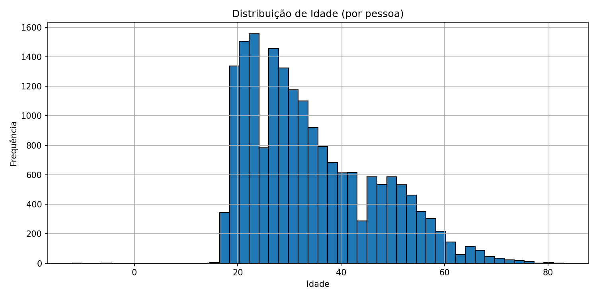
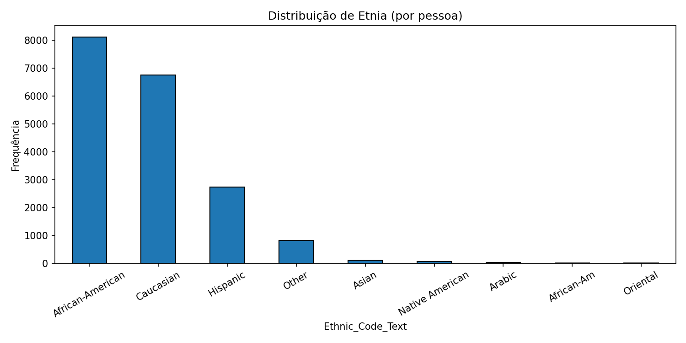
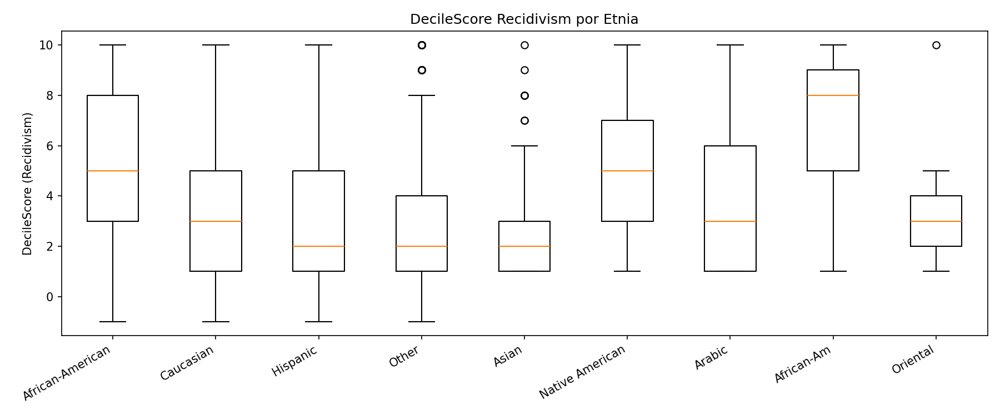
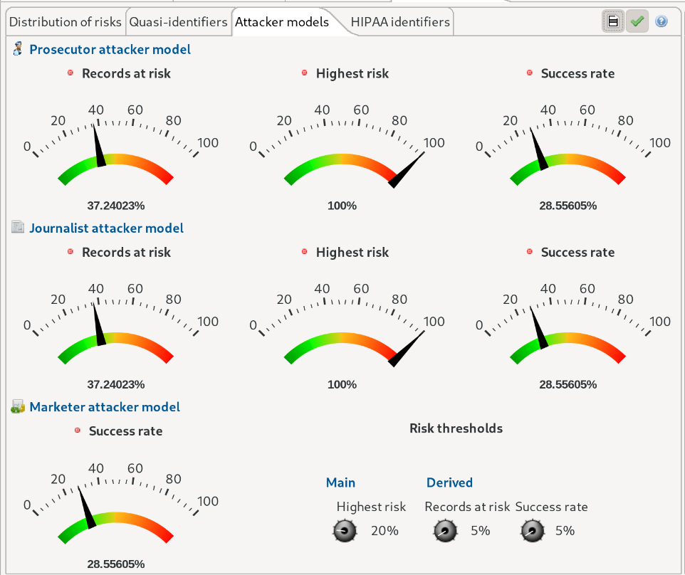
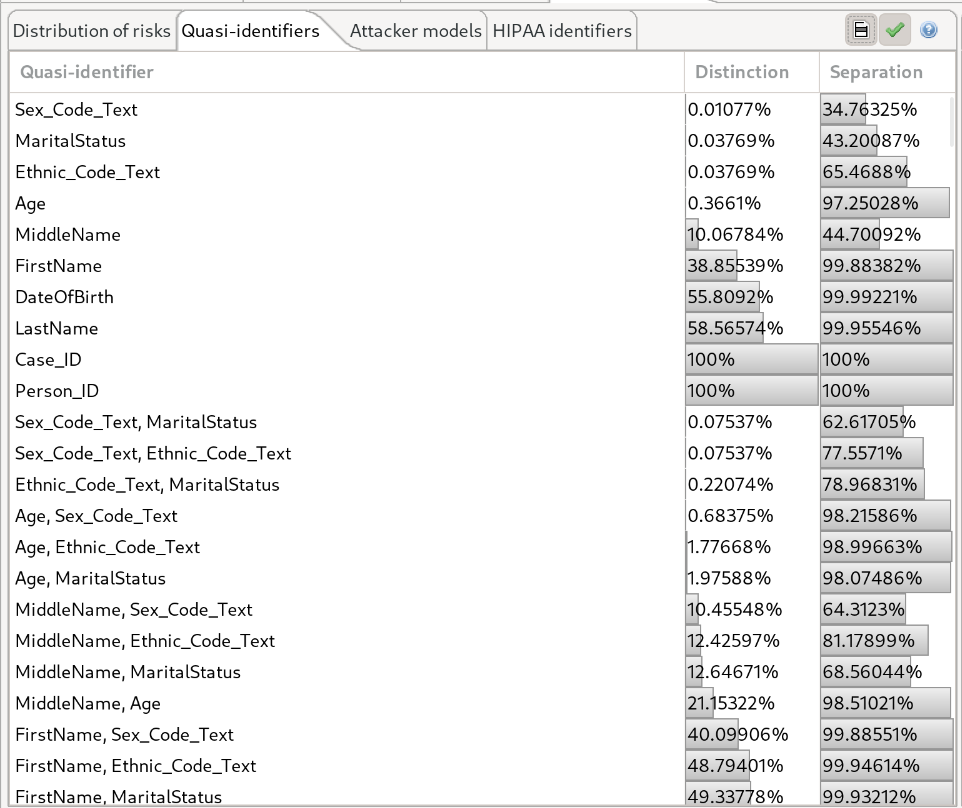
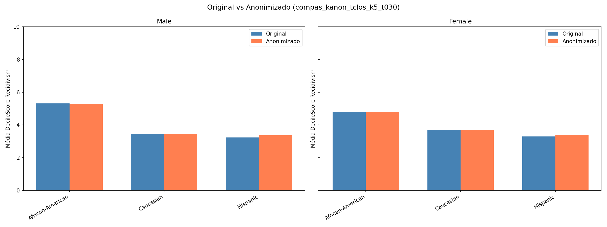

# Anonimização de Datasets com Privacidade, Utilidade e Análise de Risco

**Tecnologias de Reforço da Privacidade**

---

## 1. Seleção, Importação e Objetivo do Dataset

### 1.1 Dataset Escolhido

Para a realização deste trabalho foi escolhido o dataset **COMPAS Recidivism Risk Score Data**, recolhido pela organização de jornalismo investigativo ProPublica em 2016 no âmbito de uma investigação sobre potenciais enviesamentos raciais no algoritmo COMPAS (*Correctional Offender Management Profiling for Alternative Sanctions*). Este algoritmo é utilizado nos Estados Unidos para avaliar o risco de reincidência criminal de arguidos, influenciando decisões judiciais como liberdade condicional e sentenciação.

O dataset está disponível publicamente no Kaggle[^1] e contém originalmente **60.843 linhas** e **28 colunas**, com três linhas por indivíduo correspondentes a três tipos de avaliação de risco: *Risk of Recidivism*, *Risk of Violence* e *Risk of Failure to Appear*. Após sanitização, o dataset foi reduzido a **18.574 registos** (um por indivíduo) e **16 colunas**.

A escolha deste dataset justifica-se pela sua relevância no debate público sobre **justiça algorítmica**. Em 2016, a ProPublica publicou uma análise que concluiu que o COMPAS atribuía sistematicamente scores de risco mais elevados a indivíduos African-American do que a indivíduos Caucasian com perfis criminais semelhantes. Esta conclusão gerou uma discussão alargada sobre o uso de algoritmos preditivos em contextos judiciais e sobre a possibilidade de estes perpetuarem ou amplificarem desigualdades raciais existentes. A anonimização deste dataset é portanto um caso de estudo particularmente pertinente: é necessário proteger a privacidade dos indivíduos avaliados enquanto se preserva a possibilidade de estudar estas disparidades.

### 1.2 Distribuição do Dataset

A análise exploratória foi realizada em Python. A população avaliada é maioritariamente masculina (77.6%) e jovem, com mediana de 31 anos. African-Americans representam 43.7% dos registos, sendo o grupo étnico maioritário, seguido de Caucasians (36.2%) e Hispanics (14.7%). Os grupos restantes (Asian, Native American, Arabic) são muito pequenos, o que teve impacto direto na anonimização, como se discute na Secção 3. Quase todos os indivíduos têm o inglês como língua (99.6%) e as avaliações distribuem-se de forma equilibrada entre 2013 e 2014.

Os scores de risco (escala 1-10) apresentam médias relativamente baixas: DecileScore_Recidivism (média 4.19), DecileScore_Violence (média 3.21) e DecileScore_FTA (média 3.08), com distribuição assimétrica e concentração nos valores mais baixos.

| Atributo | Valores mais frequentes |
|---|---|
| Age | 16-94 anos (média 34.3, mediana 31) |
| Sex_Code_Text | Male 77.6%, Female 22.4% |
| Ethnic_Code_Text | African-American 43.7%, Caucasian 36.2%, Hispanic 14.7%, Other 4.3%, Asian 0.6%, Native American 0.3%, Arabic 0.1% |
| MaritalStatus | Single 73.7%, Married 13.8%, Divorced 6.5% |
| Language | English 99.6%, Spanish 0.4% |
| LegalStatus | Pretrial 61.3%, Post Sentence 30.3% |
| CustodyStatus | Jail Inmate 49.2%, Probation 38.2% |
| Screening_Year | 2013 50.4%, 2014 49.6% |

### 1.3 Sanitização

O dataset original apresentava uma estrutura que requeria transformação antes de ser importado no ARX: cada indivíduo estava representado por três linhas, uma por tipo de avaliação de risco (*Recidivism*, *Violence* e *Failure to Appear*). O primeiro passo foi por isso filtrar os registos com DecileScore=-1, correspondentes a avaliações inválidas, e para indivíduos com múltiplas avaliações manter apenas a mais recente. Garantida uma linha por indivíduo, o dataset foi pivotado de forma a que os seis scores (RawScore e DecileScore para cada tipo de avaliação) passassem a colunas separadas.

A partir das datas originais foram derivados dois novos atributos: a **idade** (Age), calculada pela diferença entre DateOfBirth e Screening_Date, e o **ano de avaliação** (Screening_Year), extraído de Screening_Date. Ambas as datas foram depois removidas por constituírem atributos identifying. Foram igualmente corrigidas duas inconsistências nos valores de Ethnic_Code_Text ("African-Am" unificado com "African-American" e "Oriental" com "Asian") e removidas as colunas redundantes ou de variação nula, como ScoreText (derivável do DecileScore) e AssessmentReason, IsCompleted e IsDeleted (valor único em todos os registos).

### 1.4 Objetivo de Divulgação

O objetivo definido para a divulgação do dataset anonimizado foi permitir a análise de possíveis disparidades raciais nos scores de risco de reincidência atribuídos pelo COMPAS, por género, sem que fosse possível identificar os indivíduos avaliados. Em concreto, pretendeu-se que um investigador que acedesse ao dataset anonimizado conseguisse reproduzir a análise da ProPublica, nomeadamente comparar as médias do DecileScore_Recidivism entre grupos étnicos e géneros, sem comprometer a privacidade de nenhum dos 18.574 indivíduos presentes no dataset.

A estatística de comparação escolhida foi a média do DecileScore_Recidivism por grupo étnico e género, calculada tanto no dataset original como nos datasets anonimizados. A diferença entre estes valores, medida pelo erro médio absoluto (MAE), foi utilizada ao longo da Secção 3 para avaliar em que medida cada modelo de privacidade preservou a utilidade do dataset para este objetivo. Como se discute nessa secção, os modelos testados tenderam a generalizar o atributo Sex_Code_Text, o que limitou a análise por género no dataset anonimizado e constitui por si só um resultado relevante sobre o trade-off entre privacidade e utilidade.

### 1.5 Estatística de Comparação

Para avaliar a utilidade dos datasets anonimizados face ao objetivo de divulgação, foi calculada a média do DecileScore_Recidivism por grupo étnico e género no dataset original. Os resultados obtidos são apresentados na tabela seguinte.

| Grupo Étnico | Género | Média DecileScore | N |
|---|---|---|---|
| African-American | Female | 4.80 | 1722 |
| African-American | Male | 5.31 | 6390 |
| Caucasian | Female | 3.70 | 1703 |
| Caucasian | Male | 3.47 | 5025 |
| Hispanic | Female | 3.30 | 548 |
| Hispanic | Male | 3.24 | 2173 |
| Native American | Female | 5.89 | 19 |
| Native American | Male | 4.72 | 46 |
| Other | Female | 2.69 | 145 |
| Other | Male | 2.84 | 661 |
| Asian | Female | 2.91 | 22 |
| Asian | Male | 2.54 | 95 |
| Arabic | Female | 2.00 | 1 |
| Arabic | Male | 3.92 | 24 |

Os resultados confirmam a disparidade identificada pela ProPublica: African-Americans apresentaram médias sistematicamente mais elevadas do que Caucasians, tanto para o género feminino (4.80 vs 3.70) como para o masculino (5.31 vs 3.47). Esta diferença de aproximadamente 1.5 pontos numa escala de 1 a 10 foi o valor de referência que os datasets anonimizados deviam preservar para que o objetivo de divulgação fosse cumprido.

### 1.6 Requisitos de Privacidade

Para orientar o processo de anonimização, foi definido um conjunto de requisitos antes de proceder à configuração no ARX.

O limite de supressão foi fixado em 5%, permitindo que até 930 registos fossem suprimidos caso não fosse possível incluí-los em nenhuma equivalence class que satisfizesse os critérios de privacidade. Este valor foi considerado um compromisso razoável entre a proteção da privacidade e a preservação da utilidade do dataset.

O coding model escolhido foi a generalização, com preferência sobre a supressão. A métrica de utilidade selecionada foi a Granularity, que mede a proporção de informação preservada após a generalização, numa escala de 0 a 100%.

Os pesos dos atributos foram definidos de acordo com a relevância de cada QID para o objetivo de divulgação. Ethnic_Code_Text recebeu o peso máximo (1.0) por ser o atributo central da análise de disparidades. Age e Sex_Code_Text receberam peso 0.8, enquanto MaritalStatus, LegalStatus e CustodyStatus ficaram em 0.5. Language e Screening_Year, com baixa variação e menor relevância analítica, receberam o peso mínimo de 0.3.

Por fim, foram selecionados dois modelos de privacidade: k-Anonymity em combinação com l-Diversity e k-Anonymity em combinação com t-Closeness, analisados em detalhe na Secção 3.

## 2. Caracterização do Dataset e Coding Models

### 2.1 Caracterização de Atributos

A classificação dos atributos foi realizada em quatro categorias: identifying, quasi-identifying, sensitive e insensitive.

Os atributos identifying são aqueles que identificam diretamente um indivíduo e foram excluídos do dataset antes da importação no ARX. Neste grupo incluem-se Person_ID, Case_ID, AssessmentID (identificadores internos do sistema), FirstName, LastName e MiddleName (nome completo do indivíduo) e DateOfBirth (substituída pelo atributo derivado Age).

Os atributos quasi-identifying (QIDs) são aqueles que, isoladamente, não identificam um indivíduo, mas cuja combinação pode permitir a sua re-identificação. Foram classificados como QIDs: Age, Sex_Code_Text, Ethnic_Code_Text, MaritalStatus, Language, LegalStatus, CustodyStatus e Screening_Year.

Os atributos sensitive são aqueles que contêm informação privada que o indivíduo não desejaria ver revelada. Neste grupo incluem-se os scores produzidos pelo algoritmo COMPAS: DecileScore_Recidivism, DecileScore_Violence, DecileScore_FTA, RawScore_Recidivism, RawScore_Violence, RawScore_FTA e RecSupervisionLevelText. Estes valores representam avaliações de risco que podem influenciar decisões judiciais e têm potencial discriminatório comprovado.

Por fim, Agency_Text foi classificado como insensitive, por se referir à agência pública responsável pela avaliação e não conter informação associada ao indivíduo.

### 2.2 Riscos de Privacidade do Dataset Original

Antes de proceder à anonimização, foi realizada uma análise de risco do dataset original no ARX, considerando três modelos de atacante: Prosecutor, Journalist e Marketer.

| Modelo de Atacante | Highest Risk | Records at Risk | Success Rate |
|---|---|---|---|
| Prosecutor | 100% | 37.24% | 28.56% |
| Journalist | 100% | 37.24% | 28.56% |
| Marketer | - | - | 28.56% |

Os valores iguais entre Prosecutor e Journalist indicam a presença de um número significativo de registos únicos nos QIDs, ou seja, indivíduos cuja combinação de atributos quasi-identifying não partilhavam com nenhum outro registo do dataset. Com um risco máximo de 100% e cerca de 37% dos registos em risco, o dataset original estava claramente desprotegido e não poderia ser divulgado sem anonimização.

A análise de distinction e separation dos QIDs no ARX permitiu também compreender quais os atributos mais discriminativos. Age revelou-se o mais problemático, com uma separation de 97.25%, seguido de Ethnic_Code_Text (65.47%) e MaritalStatus (43.20%). As combinações mais discriminativas foram Age com Ethnic_Code_Text (99.0% de separation) e Age com Sex_Code_Text (98.2%), o que justificou a atribuição de pesos mais elevados a estes atributos na configuração do ARX.

### 2.3 Criação de Hierarquias

Para cada QID foi definida uma hierarquia de generalização que determina como os valores originais são progressivamente agrupados até atingir o valor mais genérico. A profundidade e estrutura de cada hierarquia foram definidas com base na distribuição dos valores e na relevância do atributo para o objetivo de divulgação.

**Age** é o QID mais discriminativo do dataset, com uma separation de 97.25%, e por isso recebeu a hierarquia mais profunda. Os valores originais são agrupados progressivamente em intervalos de 5, 10 e 20 anos, sendo o nível máximo o valor genérico. Esta progressão gradual permitiu ao ARX escolher o nível de generalização mais adequado em cada configuração sem forçar perdas de informação desnecessárias.

**Ethnic_Code_Text** recebeu uma hierarquia de três níveis que sofreu uma iteração durante o processo de anonimização. Na versão inicial, o nível 1 renomeava African-American para "Black", o que destruía a estatística objetivo por impedir a comparação direta com os dados originais. A hierarquia foi revista para manter "African-American" no nível 1, fundindo apenas os grupos mais pequenos (Arabic, Asian, Native American e Other) em "Other Minority". No nível 2, estes grupos, juntamente com Hispanic, são agrupados em "Minority", mantendo apenas a distinção face a Caucasian. Esta iteração ilustra de forma concreta como a definição das hierarquias influencia diretamente a preservação do objetivo de divulgação: uma escolha aparentemente técnica, como a renomeação de um valor, pode comprometer toda a análise pretendida.

Os restantes QIDs seguiram uma lógica semelhante, com hierarquias dimensionadas à sua variação natural. **MaritalStatus** foi agrupado num nível intermédio em quatro categorias semânticas (Single, In Relationship, Former e Unknown) antes de colapsar para o valor genérico. **LegalStatus** e **CustodyStatus** seguiram a mesma estrutura, com um nível que agrupa os valores por categoria jurídica. **Sex_Code_Text**, **Language** e **Screening_Year**, por terem apenas dois valores cada, possuem hierarquias com um único nível de generalização, passando diretamente para o valor genérico.

### 2.4 Pesos dos Atributos

No ARX, os pesos dos atributos quasi-identifying determinam a importância relativa de cada um na métrica de utilidade, influenciando as transformações que o ARX privilegia ao explorar o espaço de soluções. Atributos com peso mais elevado são generalizados com mais relutância, pois a sua perda de informação penaliza mais a métrica de granularity.

Os pesos foram definidos com base na relevância de cada QID para o objetivo de divulgação. Ethnic_Code_Text recebeu o peso máximo de 1.0, por ser o atributo central da análise de disparidades raciais. Age e Sex_Code_Text receberam peso 0.8, uma vez que são também determinantes para a estatística de comparação e para a caracterização dos indivíduos avaliados. MaritalStatus, LegalStatus e CustodyStatus foram fixados em 0.5, por terem relevância analítica moderada mas não serem críticos para o objetivo principal. Por fim, Language e Screening_Year receberam o peso mínimo de 0.3, dado que a sua variação é muito reduzida no dataset, como se verificou na análise exploratória.

| Atributo | Peso |
|---|---|
| Ethnic_Code_Text | 1.0 |
| Age | 0.8 |
| Sex_Code_Text | 0.8 |
| MaritalStatus | 0.5 |
| LegalStatus | 0.5 |
| CustodyStatus | 0.5 |
| Language | 0.3 |
| Screening_Year | 0.3 |

## 3. Modelos de Privacidade: Utilidade, Privacidade e Avaliação de Risco

Nesta secção são apresentados e analisados os resultados da aplicação de dois modelos de privacidade ao dataset COMPAS: k-Anonymity em combinação com l-Diversity e k-Anonymity em combinação com t-Closeness. Para cada modelo foram testadas várias configurações de parâmetros, avaliando o impacto nas métricas de privacidade, utilidade e na preservação da estatística objetivo. A análise foi realizada com o ARX, utilizando os atributos, hierarquias e pesos definidos na Secção 2.

### 3.1 k-Anonymity e l-Diversity

O modelo k-Anonymity garante que cada registo é indistinguível de pelo menos k-1 outros registos nos atributos quasi-identifying, agrupando os dados em equivalence classes de tamanho mínimo k. A l-Diversity complementa este modelo ao exigir que cada equivalence class contenha pelo menos l valores distintos do atributo sensível, protegendo contra ataques de homogeneidade em que todos os registos de uma classe partilham o mesmo valor sensível. Neste trabalho, o atributo sensível utilizado para l-Diversity foi RecSupervisionLevelText, por ser o único atributo sensível categórico, o que torna a contagem de valores distintos diretamente aplicável.

Foram testadas quatro configurações, variando k e l de forma independente para isolar o efeito de cada parâmetro.

#### 3.1.1 Variação de k (l=3 fixo)

Para avaliar o impacto do parâmetro k, foram testadas duas configurações com l=3 fixo: k=5 e k=10. Os resultados são apresentados na tabela seguinte.

| Configuração | Suprimidos | Granularity | Highest Risk | MAE objetivo | Eq. classes | k real |
|---|---|---|---|---|---|---|
| k=5, l=3 | 4.85% | 69.99% | 20% | 0.108 | 78 | 5 |
| k=10, l=3 | 2.44% | 66.49% | 10% | 0.038 | 64 | 10 |

O resultado mais relevante desta comparação é que k=10 dominou k=5 em quase todas as métricas: menos registos suprimidos (2.44% vs 4.85%), risco mais baixo (10% vs 20%) e melhor preservação da estatística objetivo (MAE 0.038 vs 0.108), ao custo de uma ligeira redução na granularity (66.49% vs 69.99%). Este resultado aparentemente paradoxal explica-se pela interação entre os dois modelos: classes de maior dimensão satisfazem o critério l=3 de forma mais natural, dispensando generalizações mais agressivas dos QIDs. Com k=5, o ARX foi forçado a generalizar Ethnic_Code_Text para o nível 1 da hierarquia, fundindo os grupos mais pequenos em "Other Minority", enquanto com k=10 essa generalização continuou a ser necessária mas produziu classes mais equilibradas com menos supressão.

#### 3.1.2 Variação de l (k=5 fixo)

Para avaliar o impacto do parâmetro l, foram testadas duas configurações com k=5 fixo: l=2 e l=3.

| Configuração | Suprimidos | Granularity | Highest Risk | MAE objetivo | Ethnic generalizado |
|---|---|---|---|---|---|
| k=5, l=2 | 4.48% | 78.63% | 20% | 0.395 | Não |
| k=5, l=3 | 4.85% | 69.99% | 20% | 0.108 | Sim (nível 1) |

Com l=2, o critério de diversidade é mais fácil de satisfazer e o ARX conseguiu preservar os valores originais de Ethnic_Code_Text, resultando numa granularity mais elevada (78.63%). No entanto, o MAE da estatística objetivo foi substancialmente pior (0.395), porque os grupos étnicos mais pequenos, como Asian e Native American, perderam uma proporção elevada dos seus registos por supressão, distorcendo as médias calculadas. Com l=3, a necessidade de garantir três valores distintos de RecSupervisionLevelText por classe forçou o ARX a fundir estes grupos em "Other Minority", reduzindo a distorção nos grupos preservados e baixando o MAE para 0.108, ainda que à custa de uma menor granularity global.

#### 3.1.3 Resultados e Análise de Risco

A configuração k=10, l=3 foi identificada como a melhor do modelo l-Diversity, sendo por isso a mais adequada para uma eventual divulgação do dataset. A tabela seguinte apresenta a análise de risco de re-identificação para esta configuração, considerando os três modelos de atacante.

| Modelo de Atacante | Highest Risk | Records at Highest Risk | Estimated Risk |
|---|---|---|---|
| Prosecutor | 10% | 0.06% | 10% |
| Journalist | 10% | 0.06% | 10% |
| Marketer | - | - | 0.35% |

Comparando com o dataset original, onde o risco máximo era de 100% e cerca de 37% dos registos estavam em risco, a configuração k=10, l=3 reduziu o risco máximo para 10% e os registos afetados para menos de 0.1%. O risco do Marketer, que modela um atacante sem conhecimento prévio sobre os indivíduos, desceu de 28.56% para 0.35%, o que representa uma redução substancial.

No que diz respeito à preservação da estatística objetivo, a tabela seguinte compara as médias do DecileScore_Recidivism por grupo étnico e género entre o dataset original e o dataset anonimizado com k=10, l=3.

| Grupo Étnico | Género | Original | Anonimizado | Diferença |
|---|---|---|---|---|
| African-American | Female | 4.80 | 4.79 | -0.01 |
| African-American | Male | 5.31 | 5.30 | -0.01 |
| Caucasian | Female | 3.70 | 3.70 | 0.00 |
| Caucasian | Male | 3.47 | 3.46 | -0.01 |
| Hispanic | Female | 3.30 | 3.47 | +0.17 |
| Hispanic | Male | 3.24 | 3.27 | +0.03 |

Os grupos mais pequenos (Arabic, Asian, Native American e Other) foram fundidos em "Other Minority" e não são comparáveis individualmente. Para os grupos preservados, as diferenças são mínimas, com um MAE global de 0.038, o que significa que a disparidade racial identificada no dataset original é fielmente reproduzida no dataset anonimizado. Um investigador que acedesse a este dataset conseguiria reproduzir a análise da ProPublica com elevada precisão.

### 3.2 k-Anonymity e t-Closeness

O modelo t-Closeness complementa o k-Anonymity com uma garantia mais forte do que a l-Diversity: em vez de exigir apenas diversidade nos valores sensíveis, exige que a distribuição do atributo sensível dentro de cada equivalence class seja próxima da distribuição global do dataset, com uma distância máxima de t. Quanto menor o valor de t, mais semelhante tem de ser a distribuição interna à distribuição global, tornando o modelo mais restritivo. Neste trabalho, numa primeira tentativa, o t-Closeness foi aplicado a todos os atributos sensíveis simultaneamente, com t=0.20. O resultado foi um dataset praticamente inútil: o ARX produziu apenas 4 equivalence classes com mais de 2000 registos cada, generalizando Ethnic_Code_Text para o valor genérico e reduzindo a granularity para 25%. A satisfação simultânea de t-Closeness em múltiplos atributos numéricos com distribuições distintas revelou-se demasiado restritiva. Face a este resultado, optou-se por aplicar t-Closeness exclusivamente ao atributo DecileScore_Recidivism, por ser o atributo sensível central do objetivo de divulgação, reclassificando os restantes como insensitive. Esta decisão permitiu ao ARX encontrar transformações muito mais úteis, como se demonstra nos resultados seguintes.

Foram testadas duas configurações com k=5 fixo, variando o parâmetro t entre 0.20 e 0.30.

#### 3.2.1 Variação de t (k=5 fixo)

| Configuração | Suprimidos | Granularity | Highest Risk | MAE objetivo | Ethnic generalizado |
|---|---|---|---|---|---|
| k=5, t=0.20 | 4.93% | 52.45% | 1.89% | N/A | Sim (nível 2) |
| k=5, t=0.30 | 4.17% | 65.37% | 12.5% | 0.043 | Sim (nível 1) |

Com t=0.20, o ARX foi forçado a criar equivalence classes muito grandes para garantir que a distribuição dos scores em cada classe fosse suficientemente próxima da distribuição global. O resultado foram apenas 29 classes com tamanho mínimo de 53 registos, o que implicou generalizar Ethnic_Code_Text para o nível 2 da hierarquia, fundindo African-American, Hispanic e Other Minority num único grupo "Minority". Esta generalização destruiu a estatística objetivo, tornando impossível a comparação entre grupos étnicos no dataset anonimizado. Apesar do risco de re-identificação ter sido muito baixo (1.89%), a perda de utilidade foi considerada inaceitável face ao objetivo de divulgação.

Com t=0.30, uma tolerância maior permitiu ao ARX encontrar uma transformação mais equilibrada: Ethnic_Code_Text foi generalizado apenas para o nível 1 (preservando African-American, Caucasian e Hispanic como categorias distintas), com 57 equivalence classes, risco máximo de 12.5% e MAE de 0.043. Este resultado é comparável ao obtido com k=10, l=3 no modelo l-Diversity, demonstrando que ambos os modelos podem atingir níveis de utilidade semelhantes, embora com garantias de privacidade de natureza diferente.

#### 3.2.2 Resultados e Análise de Risco

A configuração k=5, t=0.30 foi identificada como a melhor do modelo t-Closeness. A tabela seguinte apresenta a análise de risco de re-identificação para esta configuração.

| Modelo de Atacante | Highest Risk | Records at Highest Risk | Estimated Risk |
|---|---|---|---|
| Prosecutor | 12.5% | 0.04% | 12.5% |
| Journalist | 12.5% | 0.04% | 12.5% |
| Marketer | - | - | 0.32% |

O risco máximo de 12.5% é ligeiramente superior ao obtido com k=10, l=3 (10%), o que é expectável dado que o k mínimo é 5, implicando classes com no mínimo 8 registos na prática. No entanto, o risco do Marketer (0.32%) é comparável ao do melhor modelo l-Diversity (0.35%), e em ambos os casos a redução face ao dataset original é substancial.

A tabela seguinte compara as médias do DecileScore_Recidivism por grupo étnico e género entre o dataset original e o dataset anonimizado com k=5, t=0.30.

| Grupo Étnico | Género | Original | Anonimizado | Diferença |
|---|---|---|---|---|
| African-American | Female | 4.80 | 4.79 | -0.01 |
| African-American | Male | 5.31 | 5.30 | -0.01 |
| Caucasian | Female | 3.70 | 3.70 | 0.00 |
| Caucasian | Male | 3.47 | 3.46 | -0.01 |
| Hispanic | Female | 3.30 | 3.40 | +0.10 |
| Hispanic | Male | 3.24 | 3.37 | +0.13 |

Com um MAE global de 0.043, a preservação da estatística objetivo é muito boa para os grupos principais. A disparidade entre African-Americans e Caucasians mantém-se praticamente inalterada, o que significa que o objetivo de divulgação foi cumprido. Tal como no modelo l-Diversity, os grupos étnicos mais pequenos foram fundidos em "Other Minority" e não são comparáveis individualmente.

É importante notar que a necessidade de restringir o t-Closeness a um único atributo sensível revela uma limitação fundamental deste modelo quando aplicado a datasets com múltiplos atributos sensíveis correlacionados. No caso do COMPAS, os três tipos de DecileScore (Recidivism, Violence e FTA) e o RecSupervisionLevelText estão todos relacionados com a avaliação de risco do indivíduo e têm distribuições distintas por grupo étnico. Exigir que a distribuição de cada um destes atributos dentro de cada equivalence class seja próxima da distribuição global é precisamente exigir que as classes não reflitam as diferenças entre grupos étnicos, o que contradiz diretamente o objetivo de divulgação. Esta tensão é estrutural: o t-Closeness, ao proteger a distribuição dos atributos sensíveis, tende a esconder as mesmas disparidades que se pretendia estudar, tornando-o um modelo de privacidade particularmente inadequado para datasets cujo objetivo de divulgação é precisamente a análise de diferenças entre grupos.

### 3.3 Comparação entre Modelos e Recomendação Final

A tabela seguinte resume os resultados de todas as configurações testadas, permitindo uma comparação direta entre os dois modelos de privacidade.

| Configuração | Suprimidos | Granularity | Highest Risk | MAE objetivo |
|---|---|---|---|---|
| k=2, l=2 | 4.21% | 77.36% | 50% | 0.380 |
| k=5, l=2 | 4.48% | 78.63% | 20% | 0.395 |
| k=5, l=3 | 4.85% | 69.99% | 20% | 0.108 |
| k=10, l=3 | 2.44% | 66.49% | 10% | 0.038 |
| k=5, t=0.20 | 4.93% | 52.45% | 1.89% | N/A |
| k=5, t=0.30 | 4.17% | 65.37% | 12.5% | 0.043 |

A análise dos resultados permite identificar dois padrões distintos. No modelo l-Diversity, o aumento de k demonstrou ser mais benéfico do que o aumento de l: k=10 com l=3 produziu melhores resultados em todas as dimensões relevantes do que k=5 com l=3 ou k=5 com l=2, devido à interação entre os dois modelos que permite a classes maiores satisfazerem naturalmente o critério de diversidade. No modelo t-Closeness, a escolha de t revelou-se crítica: t=0.20 produziu um dataset inútil para o objetivo de divulgação, enquanto t=0.30 atingiu resultados competitivos com o melhor modelo l-Diversity.

Do ponto de vista das garantias de privacidade, os dois modelos oferecem proteções de natureza diferente. A l-Diversity garante que dentro de cada classe existem pelo menos l valores distintos do atributo sensível, protegendo contra ataques de homogeneidade. O t-Closeness oferece uma garantia mais forte, exigindo que a distribuição do atributo sensível dentro de cada classe seja próxima da distribuição global, o que protege também contra ataques de inferência baseados no conhecimento da distribuição. Esta diferença reflete-se nos riscos obtidos: k=5, t=0.30 atingiu um risco máximo de 12.5% face aos 10% do k=10, l=3, mas com equivalence classes significativamente maiores em média.

A configuração recomendada para divulgação é **k=10, l=3**, por oferecer o melhor equilíbrio entre privacidade, utilidade global e preservação da estatística objetivo. O MAE de 0.038 garante que as disparidades raciais identificadas no dataset original são reproduzidas com elevada fidelidade no dataset anonimizado, cumprindo o objetivo de divulgação. Para contextos em que se pretenda uma garantia de privacidade mais forte sobre a distribuição dos scores de risco, k=5, t=0.30 constitui uma alternativa viável, com resultados muito semelhantes mas ao custo de uma maior complexidade na calibração dos parâmetros.

[^1]: https://www.kaggle.com/datasets/danofer/compass
